## GNM(그림이 널 만났을 때)

>  **예술이 어렵게 느껴지는 사람들이 쉽게 작품을 감상할 수 있는 인터렉티브 웹 전시 플랫폼**
>
>  프로젝트 기간: 21.03.01 ~ 21.04.09(6주)

[소개 동영상 보러 가기](https://www.youtube.com/watch?v=7ve5IglmUV4)

 

### 목차

[팀원 소개](#팀원-소개)

[서비스 소개](#그림이-널-만났을-때는)

[관련 문서](#관련-문서)

- 기능 명세서
- API 설계
- 와이어 프레임
- 소개 자료
- 시스템 아키텍쳐
- 서비스 플로우
- AI 모델 소개

[기능 소개](#주요-기능-화면-예시)

 

### 팀원 소개

| 이름         | 역할                                              | 프로필                                  |
| ------------ | ------------------------------------------------- | --------------------------------------- |
| 최규수(팀장) | AI 모델 학습 및 application화, 프론트 엔드 개발자 | [github](https://github.com/qsoo)       |
| 김규연       | 프론트 엔드 개발자                                | [github](https://github.com/qqyurr)     |
| 김다민       | 프론트 엔드 개발자, 영상 제작                     | [github](https://github.com/damingu)    |
| 박다솔       | 풀스택 개발                                       | [github](https://github.com/Park-Dasol) |
| 황승주       | 프론트 엔드 개발자                                | [github](https://github.com/wealways)   |

 

### 그림이 널 만났을 때는

미술관을 가는 것에 대해 심리적, 물리적 거리감이 있는 사람들이 미술작품과 가까워질 수 있도록 도와주는 웹 애플리케이션이 있다면 쉽고 편하게 미술 작품을 감상할 수 있을 것입니다. 

미술에 대해 지식이 적은 사람들이 이 서비스를 통해 작품에 대한 이해뿐만 아니라 그냥 보는 것도 감상이구나라는 생각을 가지게 하면 미술작품에 어렵지 않고 쉽게 다가갈 수 있을 것입니다. 

그래서 기존의 문화생활이 영화, 게임 등으로 국한된 사람들이 다양한 문화생활을 선택할 수 있게 도와줄 것이라 생각했습니다.

- 사용자는 메인 페이지에서 전시 중인 작가 정보 확인 가능
- 각 갤러리에서 다른 갤러리로 쉬운 이동을 위해 지도 버튼 추가
- 각 갤러리 입장시 선택적으로 사용자에게 이미지를 받아 이를 감상한 작가들의 화풍으로 변환시켜 특별 전시회 페이지에서 감상 및 저장 가능
- 감상이 끝난 뒤 방명록 페이지에서 화풍 변환된 이미지 등을 활용하여 방명록을 작성하고 다른 사용자의 방명록 감상 가능

 

### 관련 문서

| 문서 명                                                      | 내용                                                         | 비고                                     |
| ------------------------------------------------------------ | ------------------------------------------------------------ | ---------------------------------------- |
| [기능명세서](./assets/기능명세서.pdf)                        | 설계 단계에서 사용한 기능명세서 내용 Jira 분류 이용(epic - story - subtask) | 핵심 구현 기능과 선택 구현 기능으로 분류 |
| [API 설계](https://www.notion.so/roufarm/API-24705f7437a04c9db2384ec7dabc77f7) | endpoint 및 request - response 구조 설계                     | 추가적인 요구사항 설계를 통해 소통       |
| [와이어 프레임](./assets/wireframe.xd)                       | 와이어 프레임 설계(Adobe XD)                                 | `.xd` file                               |
|                                                              | [와이어 프레임 image file](./assets/wireframe_image)         |                                          |
| [소개 자료](./assets/소개자료.pdf)                           | 기획 배경 및 서비스 소개 자료                                |                                          |

### 시스템 아키텍쳐

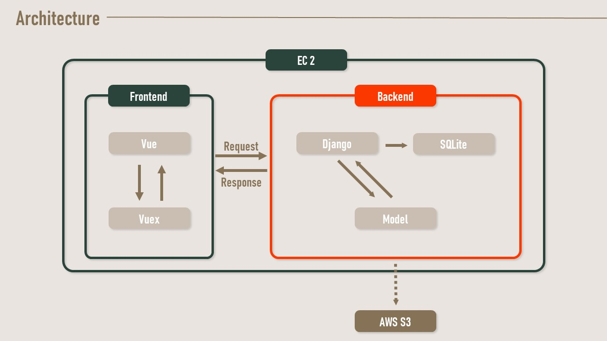

### 서비스 플로우

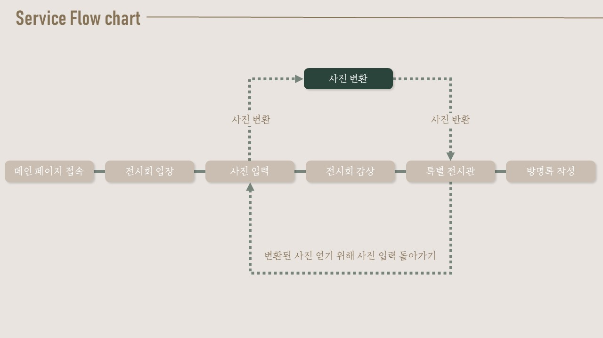

### AI 모델 소개(pytorch-AdaIN)

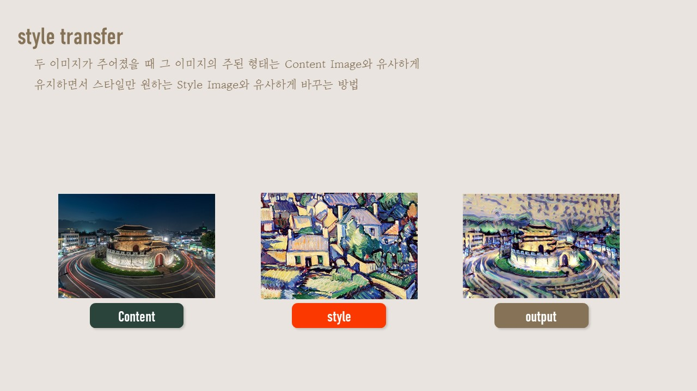

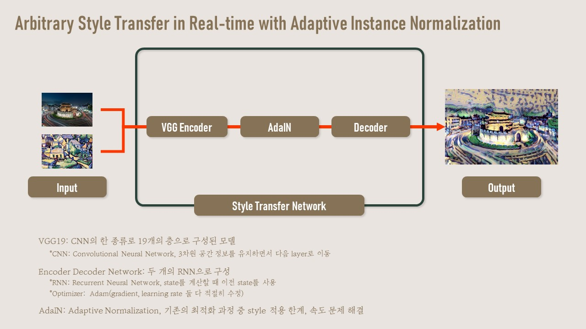

### 주요 기능 화면 예시

#### 메인 페이지

전시회 기획 의도 및 작가 정보를 확인할 수 있는 메인 페이지

 

#### 튜토리얼

**가벼운 감상**이 전체적인 핵심 기능이기 때문에 부수적인 기능에 대한 설명이 부족할 수 있다고 판단
작품 감상 전 사용법에 대한 안내 튜토리얼을 통해 사용자 편의성 확보

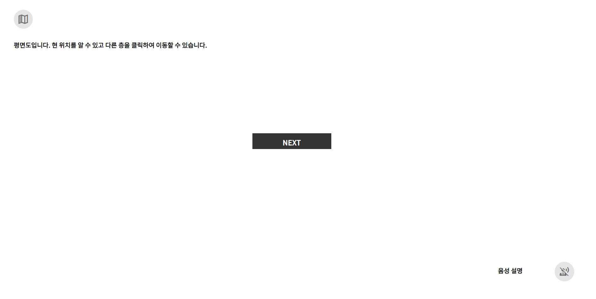

 

#### 전시회 지도

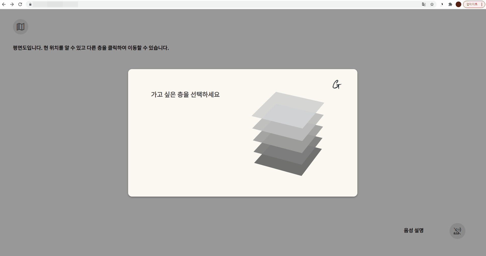

층 별로 분리된 전시회의 느낌을 이용코자 전시회 지도 기능 추가

 

| 전시회 지도 화면                                             | (입장 전) 지도 화면                 |
| ------------------------------------------------------------ | ----------------------------------- |
| 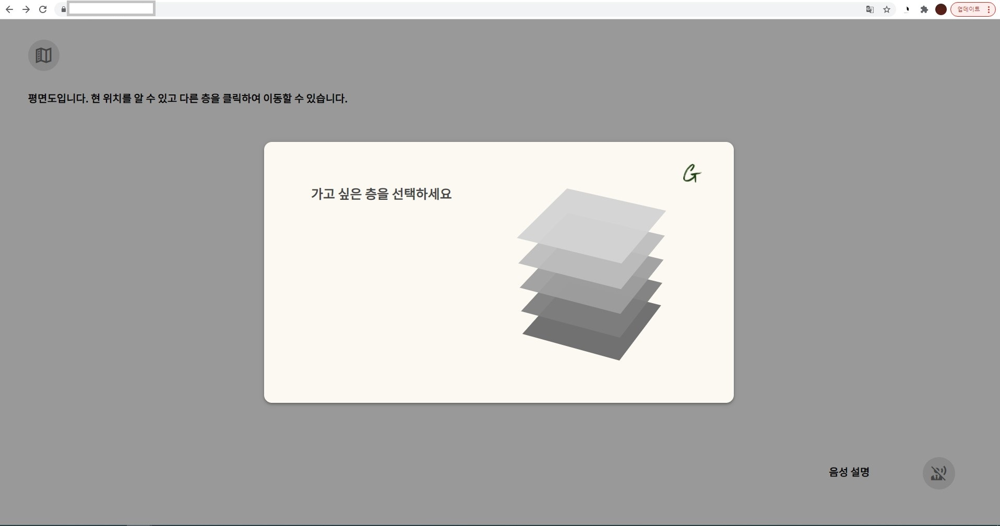                          | 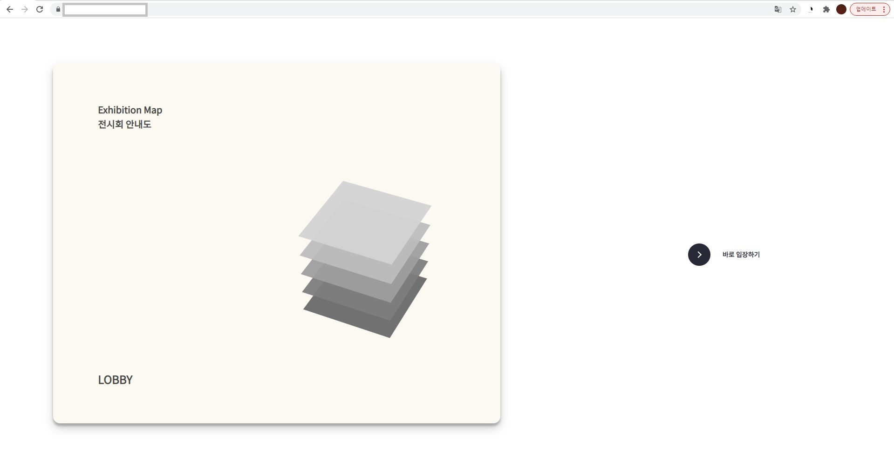 |
| 전체 감상 흐름이 존재하지만 먼저 보고 싶은 갤러리는 이동을 통해 감상 가능 | 튜토리얼 후 지도 사용법             |

 

#### 작가 소개 페이지

작가에 대한 간단한 설명

작가에 대한 자세한 설명은 작품 감상이 어려워지게 만들 수 있다고 판단하여 

간단한 한마디 정도를 덧붙이는 식으로 진행

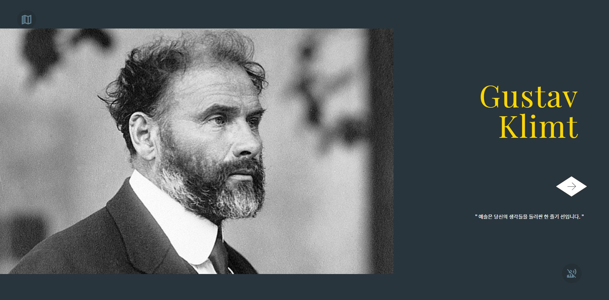

 

#### 작가별 대표 인터렉티브 요소

작가별로 대표 인터렉티브가 강조된 작품을 갤러리 첫 진입 페이지에 배치하여 사용자 흥미 유발

| Monet                           | Klimt                           | 천경자                          |
| ------------------------------- | ------------------------------- | ------------------------------- |
|  |  | 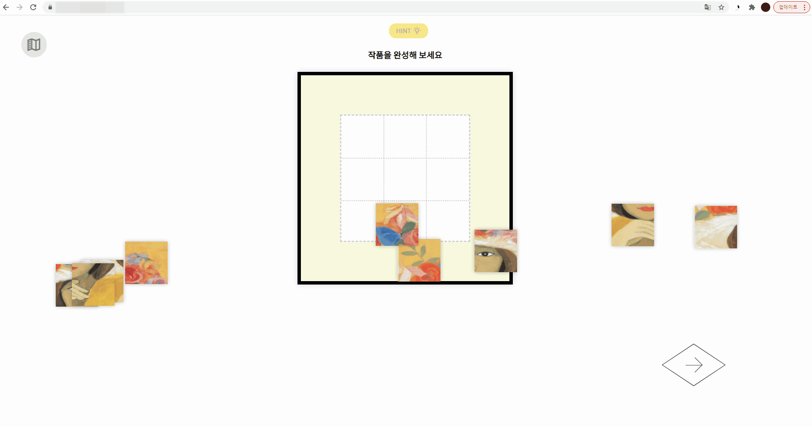 |

 

#### 사진 업로드

작가들의 작품을 감상한 다음 해당 작가들의 화풍으로 이미지 변환을 시켜 특별 전시회에서 감상할 수 있게함

- 사용자들의 참여 유발

- (사용자가 이미지를 업로드하고 싶지 않을 상황을 고려) 업로드 없이 진행할 경우 default 이미지를 특별 전시회에서 감상할 수 있음

| 사진 업로드 화면                | 미 업로드 진행 시                |
| ------------------------------- | -------------------------------- |
| 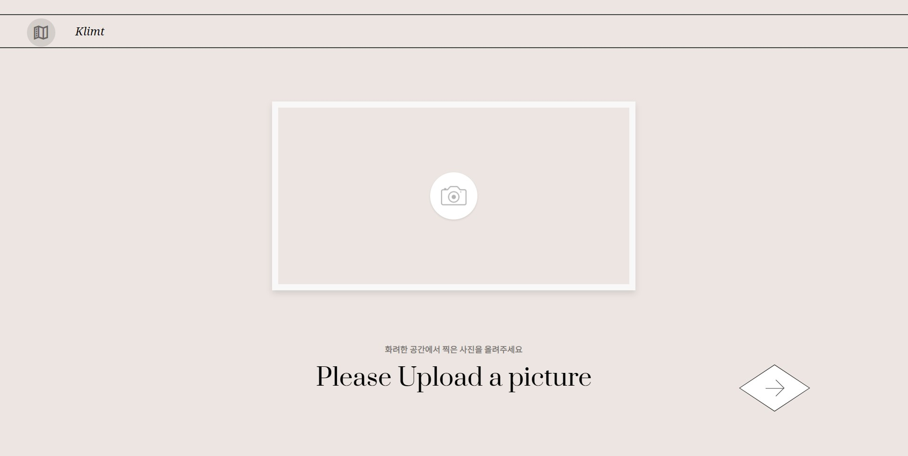 | 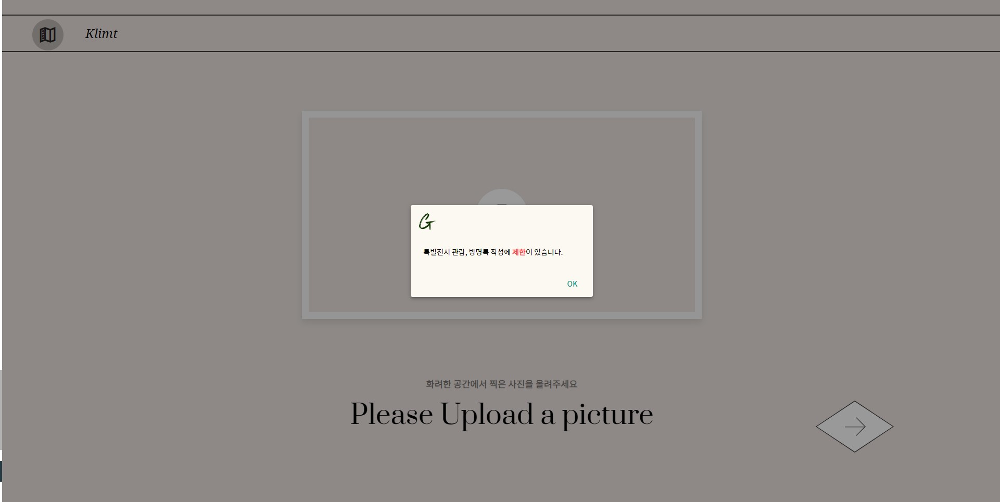 |

 

#### 특별 전시회

전시회 마지막 부분에선 사용자들의 이미지 사진을 활용하여 각 작가의 화풍변환된 사용자 input 이미지를 감상할 수 있음. 전시회 감상 후 얻어갈 수 있는 기념품 성격

| 리스트                             | 디테일                             |
| ---------------------------------- | ---------------------------------- |
| 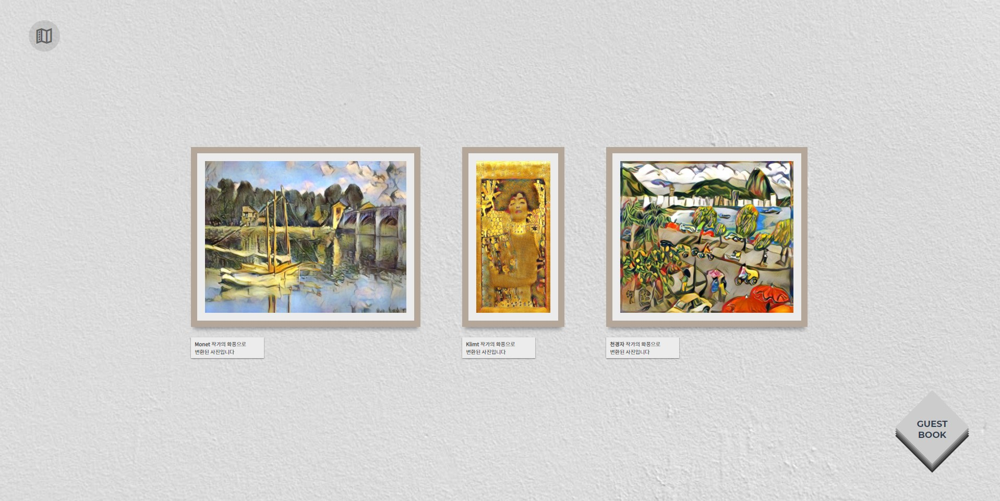 | 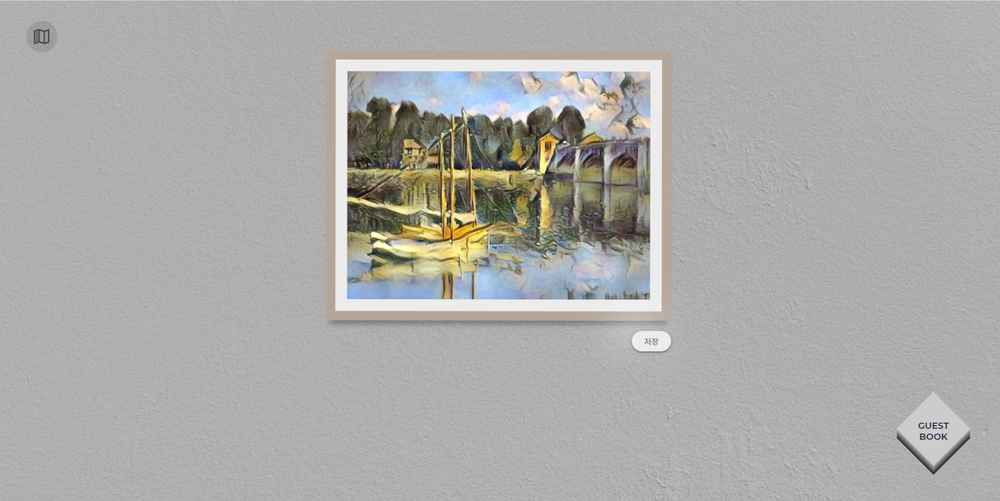 |

 

#### 방명록

전시회 감상 후 변환된 이미지를 활용하여 방명록을 남길 수 있고 다른 사용자의 방명록 감상 가능

**방명록 페이지**

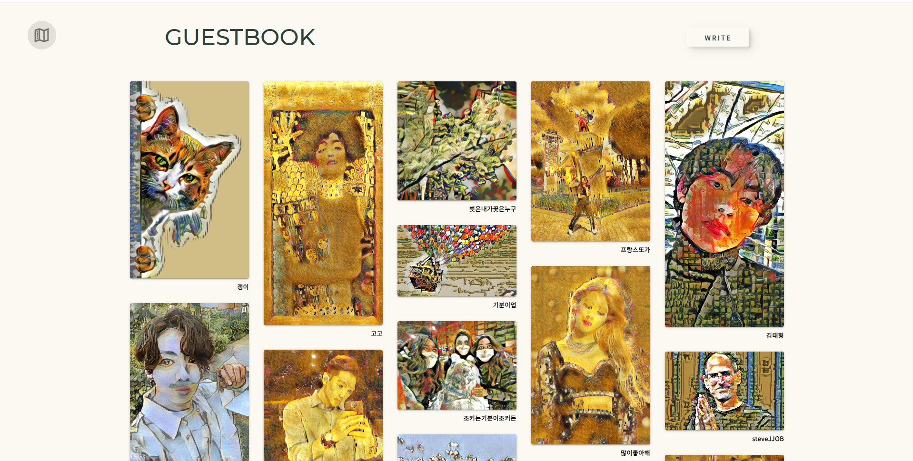

 

**방명록 디테일 페이지**

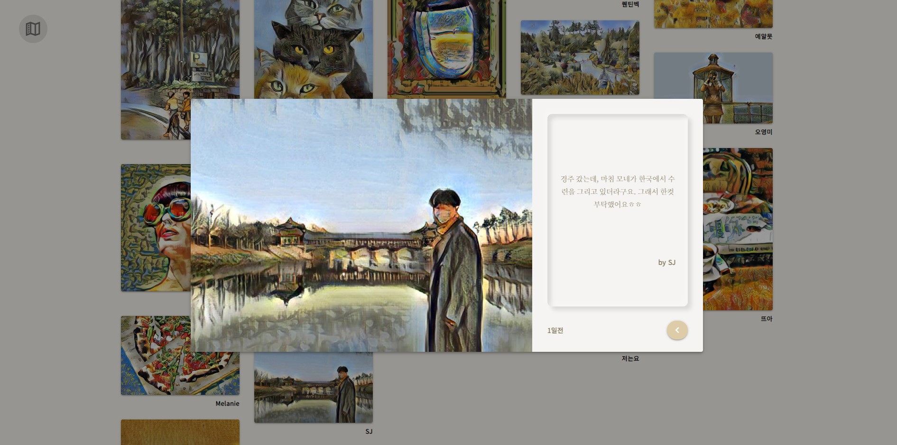

 

**방명록 작성 form**

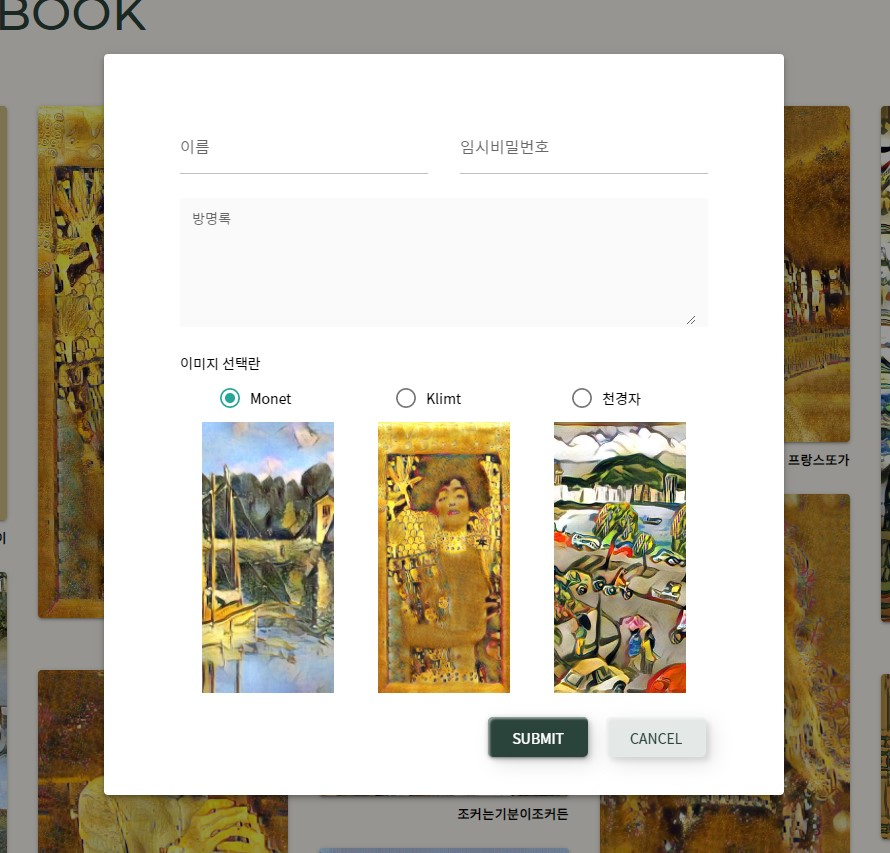

 

